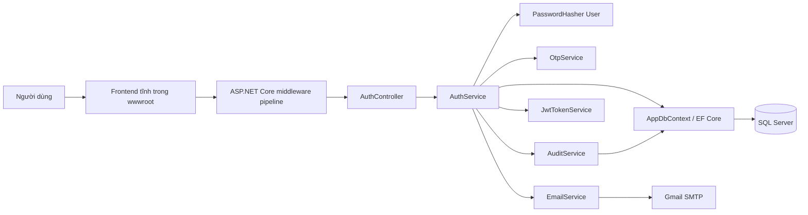
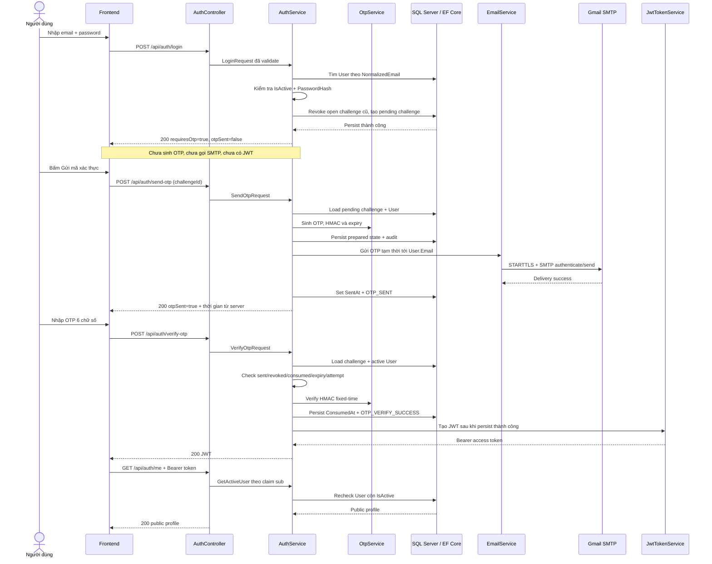
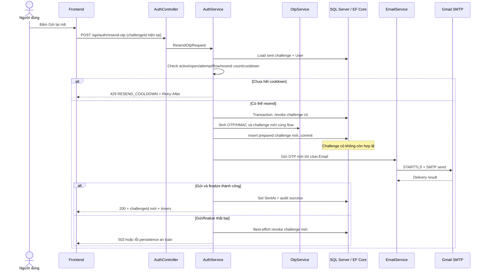

# PHASE 14 - Kiến trúc hệ thống

## 1. Tổng quan

Hệ thống là một **ASP.NET Core Web API monolith trên .NET 8**. Frontend HTML/CSS/JavaScript tĩnh nằm trong `wwwroot` và được phục vụ cùng origin với API. Backend dùng kiến trúc phân lớp đơn giản:

```text
Browser / Frontend
        ↓
ASP.NET Core middleware + AuthController
        ↓
AuthService và các service chuyên trách
        ↓
Entity Framework Core / AppDbContext
        ↓
SQL Server
```

Project không dùng Microservices, CQRS, Repository layer, message broker hay distributed cache.

## 2. Sơ đồ kiến trúc



`GET /api/auth/me` là action có `[Authorize]` ngay trong `AuthController`; source hiện tại không có `ProtectedController` riêng.

## 3. Trách nhiệm các thành phần

### Middleware pipeline

- Trả validation error theo Problem Details và bắt exception ngoài dự kiến mà không trả stack trace.
- Đặt security headers; response dưới `/api/auth` có `Cache-Control: no-store` và `Pragma: no-cache`.
- Giới hạn auth POST body ở 16 KiB.
- Áp dụng fixed-window rate limiter theo địa chỉ IP quan sát bởi server.
- Xác thực JWT Bearer và authorization.
- Chỉ bật Swagger trong môi trường Development; ngoài Development bật HSTS và HTTPS redirection.

### `AuthController`

- Công khai `register`, `login`, `send-otp`, `verify-otp`, `resend-otp`.
- Cung cấp action protected `GET /api/auth/me`.
- Nhận DTO, dựa vào automatic model validation, gọi `IAuthService` và ánh xạ kết quả sang HTTP status/code.
- Không truy cập `AppDbContext`, sinh OTP hoặc tạo JWT trực tiếp.

### `AuthService`

- Điều phối register, password login, first send, verify OTP, resend và đọc active User.
- Chỉ lấy User/email/purpose/trạng thái challenge từ database; client chỉ truyền các field DTO cho phép.
- Quản lý thứ tự persist state, gọi SMTP, compensation khi delivery lỗi và concurrency retry.
- Chỉ gọi `JwtTokenService` sau khi `ConsumedAt` đã được lưu thành công.

### `PasswordHasher<User>`

- Dùng implementation mặc định của ASP.NET Core Identity để hash và verify password; database chỉ giữ format hash có salt/work factor của framework.
- Email không tồn tại vẫn được verify với dummy hash được tạo trong `AuthService` để giảm khác biệt timing rõ rệt.
- Source hiện không xử lý riêng kết quả `SuccessRehashNeeded`; tài liệu không tuyên bố có cơ chế tự cập nhật hash khi đăng nhập.
- Password plaintext chỉ tồn tại tạm trong request/memory và không được đưa vào entity, response hoặc log.

### `OtpService`

- Sinh mã 6 chữ số bằng `RandomNumberGenerator.GetInt32`, giữ được số `0` ở đầu bằng định dạng `D6`.
- Tạo HMAC-SHA-256 bằng key riêng và payload bind `AuthenticationFlowId`, challenge, User, purpose và OTP.
- So sánh hash bằng `CryptographicOperations.FixedTimeEquals`.
- Tạo pending/prepared/resend challenge và kiểm tra expiry, attempt, cooldown, revoke.
- Không persist dữ liệu; `AuthService` và EF Core đảm nhiệm việc lưu.

### `EmailService`

- Dùng MailKit, Gmail SMTP mặc định ở port 587 và `SecureSocketOptions.StartTls`.
- Lấy credential từ configuration; Google App Password được bỏ khoảng trắng trước khi authenticate.
- Mỗi lần gửi tạo một SMTP client, connect, authenticate, send rồi disconnect.
- Không log body email hoặc OTP. Log vận hành chỉ dùng category cố định, exception type, host/port và email đã mask.

### `JwtTokenService`

- Tạo access token HS256 với `sub`, `jti`, `iat`, `nbf`, `exp`, issuer và audience.
- Token có TTL 15 phút.
- Validation yêu cầu token đã ký, đúng HS256, issuer, audience, lifetime và dùng clock skew 30 giây.
- OTP HMAC key và JWT signing key phải là hai Base64 key khác nhau, mỗi key giải mã được ít nhất 32 byte.

### `AuditService`

- Chỉ ghi event type/reason code từ allowlist và metadata giới hạn độ dài.
- Thu thập User ID, challenge ID, IP, User-Agent, trace/correlation ID và thời điểm UTC khi có.
- Không có field password, OTP plaintext, OTP hash, JWT hay secret.
- Một số audit đi cùng `SaveChanges` của state; audit sau JWT/SMTP dùng `TryRecordAsync` best-effort.

### `AppDbContext`

- Quản lý `Users`, `OtpChallenges`, `AuditLogs` bằng EF Core SQL Server.
- Cấu hình key, foreign key, index, check constraint và `rowversion`.
- Truy vấn nghiệp vụ dùng LINQ/parameterized SQL. Raw SQL trong migration chỉ dùng để backfill dữ liệu, không nhận input client.

## 4. Authentication flow thực tế

Password đúng **chưa phải** authentication thành công. Luồng được tách thành ba request: password login, gửi OTP lần đầu và verify OTP.



Nếu password/email sai hoặc User inactive, `/login` trả cùng lỗi `INVALID_CREDENTIALS`. Nếu SMTP hoặc bước finalize sau SMTP thất bại, API không trả success; service cố gắng revoke challenge theo hướng fail closed.

## 5. Resend OTP flow



Resend chỉ nhận challenge đã ở trạng thái sent. Cooldown tính từ `SentAt`; challenge expired vẫn có thể resend nếu flow và số lượt còn hợp lệ. Challenge mới giữ `AuthenticationFlowId`/`FlowExpiresAt`, tăng `ResendCount` và reset `AttemptCount`.

## 6. State và tính nhất quán

| State | Dấu hiệu chính | Verify | First send | Resend |
|---|---|---:|---:|---:|
| Pending | Hash/expiry/sent đều null | Không | Có | Không |
| Prepared | Có hash/expiry, chưa có `SentAt` | Không | Không | Không |
| Sent | Có hash/expiry/`SentAt`, chưa terminal | Có nếu còn hạn/lượt | Không | Có sau cooldown nếu flow còn hạn |
| Consumed | Có `ConsumedAt` | Không | Không | Không |
| Revoked/locked | `IsRevoked = true` | Không | Không | Không |

- `RowVersion` bảo vệ optimistic concurrency trên User và challenge.
- Filtered unique index bảo đảm tối đa một open challenge trên `(UserId, Purpose)`.
- Login và resend dùng `BeginTransactionAsync` cho đoạn revoke/insert; code không chỉ định `Serializable`, nên dùng isolation mặc định của provider.
- Verify đúng/sai dùng một `SaveChangesAsync` để persist challenge cùng audit tương ứng. Conflict `RowVersion` được reload/re-evaluate; verify retry tối đa 6 lần.
- SQL transaction không bao quanh SMTP. Delivery/finalize failure được xử lý bằng compensation best-effort.

## 7. Rate limiting và request protection

Các policy đều là fixed window, partition theo `RemoteIpAddress`, queue limit bằng 0:

| Endpoint | Policy thực tế |
|---|---:|
| `POST /api/auth/register` | 5 request / 3600 giây / IP |
| `POST /api/auth/login` | 5 request / 60 giây / IP |
| `POST /api/auth/send-otp` | 3 request / 300 giây / IP |
| `POST /api/auth/verify-otp` | 10 request / 60 giây / IP |
| `POST /api/auth/resend-otp` | 3 request / 300 giây / IP |

Rate limiter là lớp ngoài. Hard limit 5 OTP sai/challenge, cooldown 60 giây, tối đa 3 resend và flow TTL 10 phút vẫn được service kiểm tra độc lập.

## 8. Configuration và secrets

Các giá trị nhạy cảm được đọc từ configuration, ưu tiên .NET User Secrets hoặc environment variables ở local/deployment:

- `ConnectionStrings:DefaultConnection`
- `Otp:HashingKey`
- `Jwt:SigningKey`
- `Email:Username`
- `Email:Password`
- `Email:FromEmail`

Repository chỉ chứa cấu hình không nhạy cảm và placeholder rỗng. Không đưa giá trị secret thật vào source, log hoặc tài liệu.

## 9. Cấu trúc project

```text
src/OTPAuth.API/
  Configuration/
  Controllers/
  Data/
  DTOs/
  Entities/
  Services/
  Swagger/
  wwwroot/
tests/OTPAuth.Tests/
docs/
```

## 10. Giới hạn hiện tại

- Rate limiter lưu trong memory của một process và chỉ partition theo IP; chưa có quota dùng chung theo normalized email/User.
- SQL Server và SMTP không có distributed transaction; compensation sau delivery failure là best-effort.
- Gmail SMTP phù hợp demo, chưa có durable outbox, timeout/retry policy riêng hoặc email provider production.
- JWT không có refresh token hoặc server-side revocation; logout chỉ xóa token ở client.
- Frontend demo giữ JWT trong `sessionStorage`; mô hình production cần đánh giá lại XSS/token storage.
- Audit/challenge retention, secret rotation và trusted reverse proxy là trách nhiệm vận hành chưa được tự động hóa trong project.
