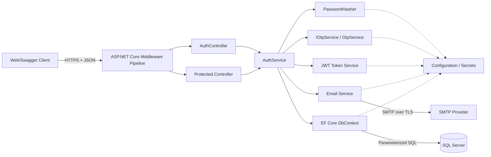
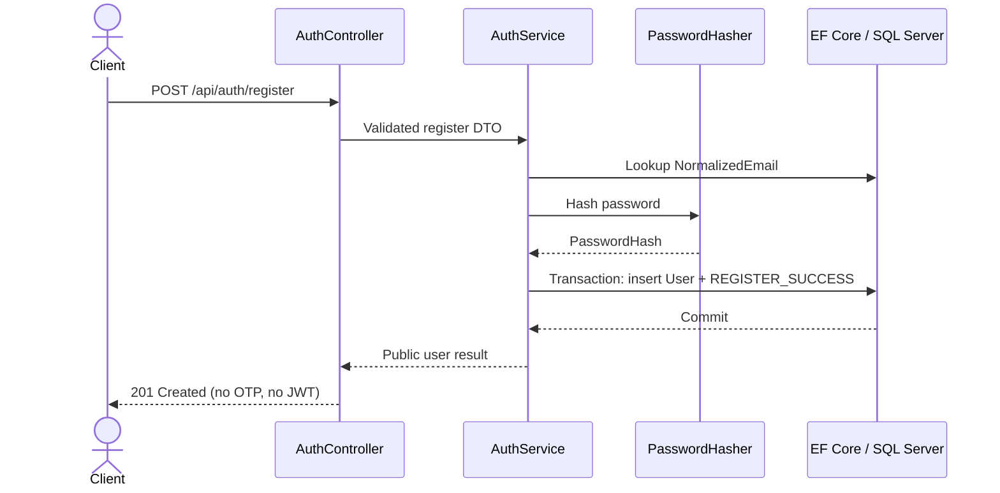
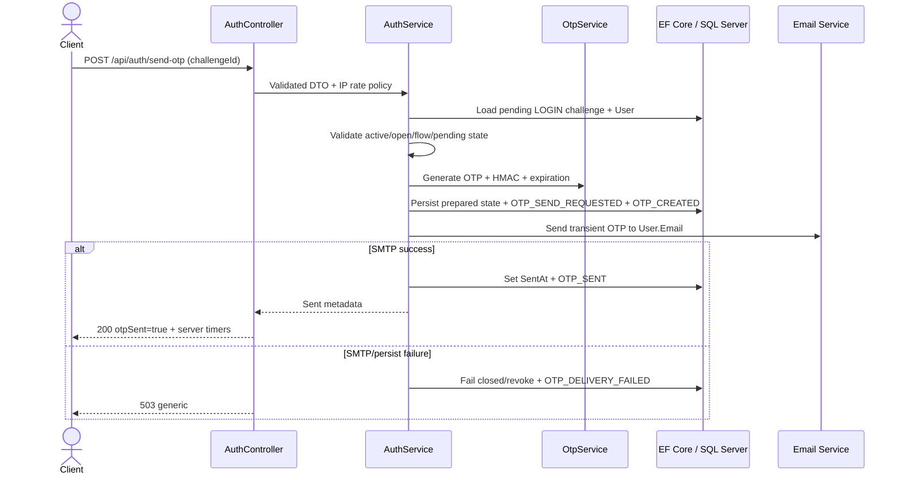

# PHASE 0 - Thiết kế kiến trúc

## 1. Mục tiêu

Hệ thống sử dụng kiến trúc monolith phân lớp đơn giản, phù hợp với bài tập lớn và đúng ràng buộc công nghệ:

`ASP.NET Core Web API -> Entity Framework Core -> SQL Server`

Thiết kế ưu tiên tính đúng, an toàn, dễ đọc, dễ kiểm thử và dễ trình bày. Không sử dụng Microservices, CQRS, Event Sourcing, message broker, Redis, Docker hoặc một abstraction không cần thiết.

## 2. Kiến trúc tổng thể



Luồng phụ thuộc chính vẫn là:

```text
Controller
  -> Service
    -> Entity Framework Core / DbContext
      -> SQL Server
```

Các service chuyên trách chỉ tách những chức năng có ý nghĩa bảo mật và dễ unit test; không tạo thêm tầng Repository vì EF Core `DbContext` đã đảm nhiệm Unit of Work và truy cập dữ liệu cho phạm vi nhỏ này.

## 3. Trách nhiệm từng thành phần

### 3.1. Middleware pipeline

- Bắt lỗi tập trung và trả Problem Details đã sanitize.
- Chuyển hướng/bắt buộc HTTPS và cấu hình HSTS ngoài development.
- Gắn correlation/trace ID.
- Áp dụng rate limiting thô theo IP/endpoint và request size mà không đọc body nhạy cảm.
- Xác thực JWT và thực hiện authorization cho endpoint protected.
- Không ghi request body, `Authorization`, password, OTP, JWT hoặc secret vào log.

### 3.2. Controller

- `AuthController` công khai năm endpoint register, login, send OTP lần đầu, verify OTP và resend OTP.
- Protected controller hoặc action `GET /api/auth/me` có `[Authorize]`.
- Nhận DTO theo allowlist, kích hoạt validation, gọi đúng service và ánh xạ kết quả nghiệp vụ sang HTTP status.
- Không sinh OTP, hash password, thao tác trực tiếp `DbContext` hoặc cấp JWT trong controller.

### 3.3. AuthService

- Điều phối Register Flow, Login Password Flow, First-send Flow, OTP Verification Flow, Resend Flow và Authentication Success Flow.
- Quyết định transaction boundary và thứ tự kiểm tra bảo mật.
- Kiểm tra state/cooldown/attempt theo dữ liệu server sau DTO validation; quota dùng chung theo normalized email/User vẫn là control mục tiêu chưa hiện thực.
- Chỉ lấy UserId, email nhận OTP, Purpose, timestamps và trạng thái challenge từ server/database.
- Ghi audit event trong cùng transaction với thay đổi trạng thái quan trọng khi có thể.
- Chỉ gọi `JwtTokenService` sau khi consume OTP đã commit thành công.

### 3.4. PasswordHasher

- Dùng ASP.NET Core `PasswordHasher<User>` hoặc API tương đương được framework hỗ trợ.
- Lưu format hash có salt và work factor; không tự dùng SHA-256/MD5 để hash password.
- Hỗ trợ rehash khi framework báo hash cũ cần nâng cấp ở lần đăng nhập thành công trong phase triển khai phù hợp.
- Có dummy hash cố định từ configuration/application startup để giảm timing enumeration khi email không tồn tại; dummy hash không phải credential thật và không được log.

### 3.5. `IOtpService` / `OtpService`

- Cung cấp core OTP tái sử dụng: sinh CSPRNG, format 6 chữ số, tạo/so sánh HMAC-SHA-256 fixed-time và tạo `LOGIN` challenge.
- Tập trung lifecycle `IsExpired`, `IsUsable`, increment attempt, revoke và state single-use; việc persist atomic/concurrency sẽ được thêm ở Phase 7.
- Nhận `OtpOptions` cho độ dài, TTL, flow TTL và giới hạn attempts; bản demo validate cố định 6 chữ số, 3 phút, 10 phút và tối đa 5 attempts.
- Nhận `Otp:HashingKey` tối thiểu 256 bit từ User Secrets/environment, không từ source code; payload HMAC có encoding có độ dài rõ ràng cho `AuthenticationFlowId`, `ChallengeId`, `UserId`, `Purpose` và OTP.
- Không lưu hoặc log OTP plaintext. Login chỉ tạo pending challenge; OTP chỉ sống tạm trong memory ở send/resend để chuyển một lần sang `IEmailService`.

### 3.6. JwtTokenService

- Chỉ tạo access token sau OTP verification thành công.
- Dùng HS256 với signing key ngẫu nhiên tối thiểu 256 bit cho bản demo; pin thuật toán khi validate và không chấp nhận `alg=none`.
- Đưa vào token tối thiểu các claim `sub`, `jti`, `iat`, `exp`, issuer và audience; có thể thêm email để hiển thị nhưng không đưa dữ liệu nhạy cảm.
- TTL demo là 15 phút; clock skew tối đa 30 giây.
- Không cung cấp refresh token trong phạm vi hiện tại.

### 3.7. Email Service

- `IEmailService`/`EmailService` dùng MailKit và `EmailOptions`; mỗi lần gửi tạo SMTP client riêng, dùng STARTTLS và các thao tác async.
- Chỉ nhận địa chỉ email lấy từ User trong database và OTP tạm thời từ AuthService.
- Gửi qua SMTP có TLS; SMTP credential lấy từ configuration an toàn.
- Template email chỉ nêu OTP, thời hạn thực tế tính từ `ExpiresAt` (tối đa 3 phút) và cảnh báo không chia sẻ mã.
- AuthService persist state prepared (`OtpHash`/`ExpiresAt`, chưa có `SentAt`) trước SMTP, rồi chỉ đánh dấu `SentAt` ở state sent sau delivery thành công. Delivery failure được sanitize, challenge bị fail closed/revoke và client nhận `503 OTP_DELIVERY_UNAVAILABLE`; không trả success giả.
- Không log subject/body chứa OTP và không bật SMTP protocol trace trong production.
- Không giữ SQL transaction trong khi gọi SMTP.

### 3.8. EF Core DbContext

- Quản lý ba aggregate/table nhỏ: `Users`, `OtpChallenges`, `AuditLogs`.
- Dùng parameterized query của EF Core và EF Core Migration cho mọi thay đổi schema ở Phase 2 trở đi.
- Cấu hình unique index, check constraint, foreign key, rowversion và transaction cho invariant bảo mật.
- Không tự xóa database hay tự tạo schema ngoài migration.

## 4. Request pipeline và authorization

Thứ tự logic đề xuất:

1. Exception handling và security headers.
2. HTTPS redirection/HSTS theo môi trường.
3. Routing và correlation ID.
4. Rate limiting thô theo IP/endpoint và giới hạn kích thước request.
5. Authentication JWT.
6. Authorization.
7. Model binding/DTO validation.
8. Controller và Service; tại đây áp dụng state/cooldown/attempt checks. Quota cần normalized email/User là phần còn lại đã được tài liệu hóa.

Hiện thực gắn policy fixed-window độc lập theo IP cho `register` (5/3600 giây), `login` (5/60 giây), `send-otp` (3/300 giây), `verify-otp` (10/60 giây) và `resend-otp` (3/300 giây). Middleware không đọc body có password/OTP để tạo partition key; auth POST body tối đa 16 KiB. Các quota dùng chung theo User/normalized email vẫn là việc còn lại. `GET /api/auth/me` bắt buộc JWT hợp lệ, lấy UserId từ claim `sub`, đọc lại User từ database và trả `403` nếu tài khoản đã inactive. Mọi protected endpoint tương lai phải tái sử dụng cùng kiểm tra active-user để disable User có hiệu lực ngay.

## 5. Trust boundary và luồng dữ liệu nhạy cảm

| Boundary | Dữ liệu/rủi ro | Kiểm soát |
|---|---|---|
| Client -> API | Email, password, OTP, JWT đi qua mạng; input không đáng tin | HTTPS, DTO allowlist, validation, size limit, rate limit, lỗi chung, không log body/header nhạy cảm |
| API -> SQL Server | Password hash, OTP HMAC, trạng thái challenge, audit | Tài khoản DB tối thiểu quyền, encrypted connection khi triển khai, EF parameterization, constraints, transaction |
| API -> SMTP | OTP bắt buộc xuất hiện plaintext trong nội dung email | SMTP TLS, credential ngoài source, không log body/protocol, gửi đúng email từ DB |
| API -> Secrets | JWT key, OTP hashing key, DB/SMTP credentials | Environment variables, .NET User Secrets cho local hoặc secret store; tách key theo mục đích; fail startup nếu thiếu |
| API -> Logs/Audit | Dễ vô tình lộ request/exception/PII | Allowlist field, reason code cố định, redaction, phân quyền và retention |
| Client giữ JWT | Bearer token có thể bị đánh cắp | HTTPS, `Cache-Control: no-store` cho auth response, token TTL ngắn, không đưa token vào URL/log |

Password và OTP xuất hiện trong request để server kiểm tra, vì vậy yêu cầu “không lưu/log plaintext” được thực thi bằng logging policy và lifetime ngắn trong memory; chúng không được đưa vào entity, audit, exception message hay response.

## 6. Luồng tương tác

### 6.1. Register



Unique index trên `NormalizedEmail` là hàng rào cuối cho hai request register đồng thời; một request thành công và request còn lại được ánh xạ sang `409 Conflict` đã sanitize.

### 6.2. Password login và pending challenge

```mermaid
sequenceDiagram
    actor C as Client
    participant AC as AuthController
    participant AS as AuthService
    participant DB as EF Core / SQL Server

    C->>AC: POST /api/auth/login (email, password)
    AC->>AS: Validated login DTO
    AS->>DB: Load User by NormalizedEmail
    AS->>AS: Verify IsActive + PasswordHash
    alt Credential không hợp lệ
        AS->>DB: Audit LOGIN_PASSWORD_FAILED
        AS-->>AC: Invalid credentials result
        AC-->>C: 401 generic; no challenge
    else Password đúng
        AS->>DB: Revoke previous open login challenge
        AS->>DB: Insert pending challenge + LOGIN_PASSWORD_SUCCESS
        DB-->>AS: Commit
        AS-->>AC: requiresOtp=true, otpSent=false, masked email
        AC-->>C: 200 pending metadata; no SMTP/JWT
    end
```

Pending challenge có GUID ngẫu nhiên, `OtpHash = null`, `SentAt = null`, `ExpiresAt = null` và pre-auth `FlowExpiresAt`. Password verification success không đồng nghĩa authentication success; `/login` không chờ SMTP và không thể trả JWT.

### 6.3. First send OTP



First send chỉ chấp nhận pending challenge chưa từng gửi. Client không truyền email. Gọi lại `/send-otp` sau khi challenge đã sent bị từ chối và không thể né cooldown; từ thời điểm đó chỉ `/resend-otp` được dùng.

### 6.4. OTP verification và cấp JWT

```mermaid
sequenceDiagram
    actor C as Client
    participant AC as AuthController
    participant AS as AuthService
    participant OS as OtpService
    participant DB as EF Core / SQL Server
    participant JS as JWT Token Service

    C->>AC: POST /api/auth/verify-otp (challengeId, otp)
    AC->>AS: Validated DTO
    AS->>DB: Load active LOGIN challenge + User
    AS->>AS: Require SentAt/hash/expiry; check revoked/consumed/attempt/expiry/user active
    AS->>OS: Fixed-time HMAC verification
    alt OTP sai
        AS->>DB: Atomic increment; revoke at 5; audit failure
        AS-->>AC: Verification failed result
        AC-->>C: 400 safe OTP error
    else OTP đúng
        AS->>DB: Transaction: conditional consume + audit success
        DB-->>AS: Commit won
        AS->>JS: Create expiring JWT
        JS-->>AS: Access token
        AS-->>AC: JWT result
        AC-->>C: 200 JWT
    end
```

Nếu conditional consume/concurrency check không thắng, request phải bị từ chối như replay và tuyệt đối không gọi JWT Token Service.

### 6.5. Resend OTP

```mermaid
sequenceDiagram
    actor C as Client
    participant AC as AuthController
    participant AS as AuthService
    participant OS as OtpService
    participant DB as EF Core / SQL Server
    participant ES as Email Service

    C->>AC: POST /api/auth/resend-otp (current challengeId)
    AC->>AS: Validated DTO
    AS->>DB: Load requested open challenge + User
    AS->>AS: Require sent state; check flow, resend count and cooldown from SentAt
    AS->>OS: Generate completely new OTP + HMAC
    AS->>DB: Transaction: revoke old + insert prepared replacement
    DB-->>AS: Commit
    AS->>ES: Send new OTP to User.Email
    ES-->>AS: Delivery result
    AS->>DB: On success set SentAt + success audits
    AS-->>AC: New challenge metadata or fail-closed delivery error
    AC-->>C: 200 metadata or 503 after best-effort revoke
```

`ResendOtpRequest` chỉ có `challengeId`. `AuthService` tải challenge cùng User từ database, yêu cầu challenge đã sent và dùng `SentAt` với `TimeProvider` UTC cho cooldown 60 giây. `RowVersion`/retry có giới hạn bảo vệ việc revoke challenge cũ và tạo challenge kế nhiệm prepared trong transaction SQL ngắn. OTP plaintext chỉ được giữ tạm để gọi `IEmailService`; delivery failure fail closed/revoke challenge mới. Không có JWT trong luồng resend.

Sau SMTP, AuthService chỉ finalize state sent nếu flow còn hợp lệ. Nếu finalize thất bại, response không được giả success và challenge replacement bị fail closed; email đến muộn không được coi là một mã usable nếu state sent chưa commit.

## 7. Transaction và concurrency

### Invariant phải giữ

- Mỗi `(UserId, Purpose)` có tối đa một challenge chưa consumed và chưa revoke.
- `AttemptCount` không bao giờ giảm hoặc vượt `MaxAttempts`.
- Một resend giữ nguyên `AuthenticationFlowId`/`FlowExpiresAt`, tăng `ResendCount`; flow tối đa 10 phút và 3 resend.
- Challenge chỉ đi đến một trạng thái kết thúc: consumed hoặc revoked.
- Chỉ một request có thể chuyển challenge từ usable sang consumed.
- OTP/JWT không được chấp nhận sau đúng ranh giới expiration.
- Audit của chuyển trạng thái quan trọng được commit cùng trạng thái đó.

### Cách bảo vệ đề xuất

- Thêm `RowVersion` làm EF Core concurrency token.
- Thêm filtered unique index trên `(UserId, Purpose)` khi `IsRevoked = 0 AND ConsumedAt IS NULL`.
- Dùng transaction ngắn với isolation `Serializable` cho revoke/create challenge; xử lý unique/concurrency exception theo hướng fail closed.
- Verify đúng dùng conditional update/concurrency check; commit `ConsumedAt` trước khi cấp JWT.
- Verify đúng/sai dùng `RowVersion` optimistic concurrency trong transaction ngắn. Khi conflict, service xóa tracked state, reload và đánh giá lại toàn bộ state với cùng request, tối đa 6 lần; nếu vẫn conflict thì fail closed với lỗi verify chung. Sáu lượt đủ để quan sát tối đa 5 attempt transition rồi trạng thái terminal. Vì vậy JWT chỉ được tạo bởi request đã commit `ConsumedAt`, không có lost update trong các update đã commit và challenge khóa sau 5 lần sai đã commit.
- Lấy lại `now` UTC từ `TimeProvider` ở mỗi concurrency retry và ngay sau phép so sánh HMAC trước khi mutate state; `now >= ExpiresAt` nghĩa là hết hạn.

### Các race condition bắt buộc test

| Tình huống | Kết quả bắt buộc |
|---|---|
| Hai register cùng email | Chỉ một User được tạo. |
| Hai verify đúng đồng thời | Chỉ một request consume và nhận JWT; request kia bị từ chối. |
| Nhiều OTP sai đồng thời | Không mất attempt; lần thứ 5 khóa challenge. |
| Verify và resend đồng thời | Hoặc consume thắng hoặc revoke thắng; không thể vừa cấp JWT vừa resend từ cùng trạng thái. |
| Hai resend/login đồng thời | Cuối cùng chỉ có một challenge open cho User/Purpose. |
| Verify sát `ExpiresAt` | Dùng cùng quy tắc `now >= ExpiresAt`; không có grace period ngầm. |

## 8. Xử lý lỗi

- Một exception middleware ánh xạ lỗi đã biết sang HTTP status và Problem Details thống nhất.
- Client chỉ thấy message an toàn và `traceId`; không thấy stack trace, connection string, SQL, HMAC, SMTP response chi tiết hoặc tên nội bộ.
- Login dùng cùng lỗi cho email không tồn tại, password sai và tài khoản inactive.
- Verify dùng các code/message an toàn cho chưa gửi, expired, không còn current, max attempts và OTP không khớp; không code nào trả OTP/hash, email đầy đủ hay chi tiết database.
- Chi tiết điều tra nằm trong `ReasonCode` allowlist của AuditLog, không dùng raw exception/request.
- Lỗi rate limit trả `429` và `Retry-After` khi xác định được.

## 9. Logging và audit

- Application log chỉ chứa thông tin vận hành tối thiểu như trace ID, event code và thời lượng.
- Logging provider của EF Core bị tắt trong bản demo để raw SQL/provider exception và stack không đi vòng qua exception boundary; lỗi ngoài dự kiến chỉ ghi exception type cùng trace ID đã sanitize. Môi trường production cần sink bảo mật riêng nếu muốn giữ diagnostic sâu hơn.
- Audit log chứa event bảo mật dạng cấu trúc, do `IAuditService` trung tâm tạo từ `AuthService`, không phải controller. Event đã có: `REGISTER_SUCCESS`, `LOGIN_PASSWORD_SUCCESS`, `LOGIN_PASSWORD_FAILED`, `OTP_SEND_REQUESTED`, `OTP_CREATED`, `OTP_SENT`, `OTP_DELIVERY_FAILED`, `OTP_VERIFY_FAILED`, `OTP_EXPIRED`, `OTP_REPLAY_REJECTED`, `OTP_MAX_ATTEMPTS_REACHED`, `OTP_VERIFY_SUCCESS`, `JWT_ISSUED`, `OTP_RESEND_SUCCESS`, `OTP_RESEND_FAILED`.
- Thay đổi state quan trọng (register, tạo challenge login, verify sai/consume OTP) ghi audit cùng `SaveChanges` khi có thể. Các event sau SMTP/JWT dùng best-effort; nếu ghi audit thất bại, chỉ log mã event an toàn và không làm thay đổi kết quả xác thực đã commit.
- Rate limit không ghi audit theo từng request để tránh log flood.
- Cấm ghi password, PasswordHash, OTP, OtpHash, JWT, Authorization header, SMTP/DB/JWT/HMAC secrets hoặc raw request body.
- IP là dữ liệu cá nhân; cần phân quyền đọc và chốt retention ở phase vận hành. `IAuditService` chỉ lấy IP từ `RemoteIpAddress`, User-Agent từ header nhưng cắt tối đa 256 ký tự và correlation ID server tối đa 64; không tin header forwarding khi chưa cấu hình trusted proxy.

## 10. Configuration và secrets

| Nhóm | Giá trị cấu hình chính | Mặc định thiết kế |
|---|---|---|
| OTP | TTL, max attempts, resend cooldown, flow TTL, max resend, HMAC key | 180 giây, 5, 60 giây, 10 phút, 3, key riêng >= 256 bit |
| JWT | issuer, audience, lifetime, clock skew, signing key | 15 phút, 30 giây, HS256 key >= 256 bit |
| SMTP | host, port, TLS, sender, username/password | Không có secret mặc định |
| Database | SQL Server connection string | Không commit password |
| Rate limit | Window/permit theo endpoint và partition | Theo bảng trong REQUIREMENTS.md |

Các key JWT và OTP phải khác nhau. Local development dùng .NET User Secrets hoặc environment variables; deployment dùng secret store phù hợp. Repository chỉ chứa tên key hoặc placeholder, không chứa giá trị thật. Ứng dụng fail startup nếu thiếu key, key ngắn hơn 256 bit hoặc hai key giống nhau. JWT validation chỉ chấp nhận token đã ký bằng HS256, đúng issuer/audience, có expiration 15 phút và còn lifetime.

## 11. Khả năng kiểm thử ở các phase sau

- Inject `TimeProvider` để test OTP hết hạn và cooldown không cần chờ thật.
- Tách OTP generator/protector, password hasher, JWT service và email sender qua interface nhỏ để unit test AuthService.
- Dùng email sender giả chỉ ghi nhận metadata cần kiểm tra, tuyệt đối không in OTP ra test log.
- Unit test password đúng tạo pending nhưng không gửi email/JWT; first send hợp lệ/không hợp lệ/lặp/failure; verify trước send; đúng/sai/expired/consumed/replay/max attempts; resend/cooldown/mã cũ.
- Integration test với database thật hoặc provider phù hợp để kiểm tra unique index, rowversion và transaction race.
- Test API bảo đảm response trước OTP không chứa JWT và endpoint protected từ chối token không hợp lệ.

## 12. Quyết định và giới hạn kiến trúc

- Chọn một deployable monolith và một SQL Server; rate limiter in-memory phù hợp bản demo một instance.
- Phase 12 phục vụ HTML/CSS/JavaScript tĩnh từ `wwwroot` trong cùng ASP.NET Core app. UI gọi API bằng relative URL nên không cần mở CORS.
- Challenge ID chỉ giữ trong bộ nhớ JavaScript của trang; JWT demo giữ trong `sessionStorage` và bị xóa khi logout. Password và OTP không được ghi vào Web Storage hoặc console.
- Frontend dùng ba trạng thái trong cùng OTP card: A password verified/chưa gửi, B đang gửi với CTA inline loading, C đã gửi với input và timer lấy từ `expiresAt`/`resendAvailableAt` của server. Refresh mất state memory nên quay về login và không tự gửi email.
- AuthService dùng trực tiếp DbContext; không thêm Repository, CQRS hoặc event bus.
- Chọn transaction ngắn + `RowVersion` + filtered unique index để bảo vệ OTP state.
- Chọn HMAC keyed hash cho OTP thay vì raw hash do entropy OTP thấp.
- Không cố tạo distributed transaction với SMTP; dùng compensation best-effort và chấp nhận cửa sổ reliability bị chặn bởi TTL/flow controls.
- Logout phía client và JWT TTL ngắn; chưa có refresh/revocation.
- Disable User có hiệu lực ngay trên API protected nhờ active-user policy đọc database; logout tức thì vẫn cần token revocation ngoài phạm vi.
- Email login OTP đồng thời là bằng chứng truy cập mailbox ở thời điểm đăng nhập, nhưng chưa thay thế một flow email verification/quản lý đổi email hoàn chỉnh.

## 13. Vấn đề còn cần xử lý

- Xác định SMTP provider thật, TLS mode, timeout và retry policy.
- Tạo/rotate các secret thật theo môi trường mà không làm gián đoạn challenge còn TTL.
- Đo và tinh chỉnh rate limit, nhất là phía sau reverse proxy.
- Chốt retention và quyền truy cập AuditLog/OtpChallenge.
- Nếu scale nhiều instance, cần thiết kế rate-limit store dùng chung trong một phase được phê duyệt riêng.
- Nếu cần logout thu hồi JWT tức thì mà không chờ `exp`, cần bổ sung server-side token revocation/security stamp ngoài phạm vi hiện tại.
