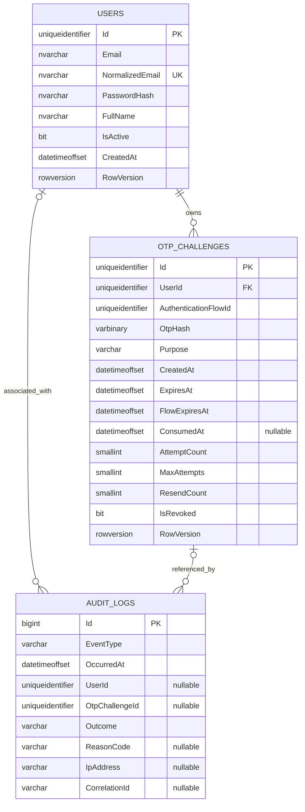

# PHASE 0 - Thiết kế database

## 1. Phạm vi và quy ước

Database đề xuất là SQL Server, truy cập qua Entity Framework Core. Phase 0 chỉ thiết kế schema; chưa tạo entity, `DbContext`, migration hoặc database.

Quy ước chung:

- Tên bảng dùng dạng số nhiều: `Users`, `OtpChallenges`, `AuditLogs`.
- Primary key của User/challenge là UUID v4 (`uniqueidentifier`) do application sinh.
- Tất cả thời điểm dùng UTC và lưu bằng `datetimeoffset(7)` để không làm tròn sai quyết định ở sát `ExpiresAt`.
- Email dùng để tra cứu qua `NormalizedEmail`; server tạo giá trị chuẩn hóa thống nhất, ví dụ trim rồi `ToUpperInvariant()`.
- OTP là chuỗi khi xử lý nhưng database chỉ lưu HMAC-SHA-256 dạng `varbinary(32)`.
- Password chỉ được lưu dưới dạng format hash do ASP.NET Core `PasswordHasher` tạo.
- Mọi thay đổi schema ở các phase sau phải đi qua EF Core Migration; không tự xóa database.

## 2. Sơ đồ quan hệ



## 3. Bảng `Users`

### 3.1. Các cột

| Cột | SQL Server type | Null | Default | Mô tả/quy tắc |
|---|---|---:|---|---|
| `Id` | `uniqueidentifier` | Không | Không | Primary key, UUID v4 do application sinh. |
| `Email` | `nvarchar(254)` | Không | Không | Email hiển thị đã trim; không dùng trực tiếp để so sánh unique. |
| `NormalizedEmail` | `nvarchar(254)` | Không | Không | Giá trị chuẩn hóa để lookup/unique không phân biệt hoa thường. |
| `PasswordHash` | `nvarchar(512)` | Không | Không | Format hash của `PasswordHasher`; không phải password plaintext. |
| `FullName` | `nvarchar(100)` | Không | Không | Tên đã trim, từ 2 đến 100 ký tự. |
| `IsActive` | `bit` | Không | `1` | Tài khoản có được phép bắt đầu/hoàn tất login hay không. |
| `CreatedAt` | `datetimeoffset(7)` | Không | Không | Thời điểm tạo UTC, không thay đổi. |
| `RowVersion` | `rowversion` | Không | SQL Server | EF Core concurrency token. |

`NormalizedEmail` là cột bổ sung ngoài danh sách tối thiểu để uniqueness không phụ thuộc hoàn toàn vào cách viết hoa/thường của input hoặc collation mặc định. `Email` vẫn được giữ để hiển thị.

### 3.2. Key, index và constraint

- `PK_Users` trên `Id`.
- Unique index `UX_Users_NormalizedEmail` trên `NormalizedEmail`.
- Check constraint: `Email` và `NormalizedEmail` dài từ 3 đến 254 ký tự; `FullName` sau trim dài từ 2 đến 100 ký tự. Đây chỉ là hàng rào cuối; format/normalization vẫn được validate ở application.
- Không có cột `Password` và không expose `PasswordHash` qua DTO/response.
- Không hard-delete User trong phạm vi hiện tại; vô hiệu hóa bằng `IsActive = 0`.

Unique index phải xử lý race của hai request đăng ký cùng email. Application lookup trước để trả lỗi thân thiện, nhưng database mới là nguồn quyết định cuối cùng.

## 4. Bảng `OtpChallenges`

### 4.1. Các cột

| Cột | SQL Server type | Null | Default | Mô tả/quy tắc |
|---|---|---:|---|---|
| `Id` | `uniqueidentifier` | Không | Không | Primary key và `challengeId` opaque trả cho client. |
| `UserId` | `uniqueidentifier` | Không | Không | FK tới `Users.Id`; không lấy từ client khi verify/resend. |
| `AuthenticationFlowId` | `uniqueidentifier` | Không | Không | ID giữ nguyên qua challenge đầu và tối đa 3 challenge resend. |
| `OtpHash` | `varbinary(32)` | Không | Không | HMAC-SHA-256; tuyệt đối không lưu OTP plaintext. |
| `Purpose` | `varchar(32)` | Không | Không | Hiện tại chỉ có mã cố định `LOGIN`. |
| `CreatedAt` | `datetimeoffset(7)` | Không | Không | Thời điểm issue/persist challenge theo UTC; là mốc cooldown, không tuyên bố thời điểm email đã đến. |
| `ExpiresAt` | `datetimeoffset(7)` | Không | Không | `min(CreatedAt + 3 phút, FlowExpiresAt)`. |
| `FlowExpiresAt` | `datetimeoffset(7)` | Không | Không | Hạn tuyệt đối của password step, mặc định 10 phút từ challenge đầu. |
| `ConsumedAt` | `datetimeoffset(7)` | Có | `NULL` | Được set đúng một lần khi verify thành công. |
| `AttemptCount` | `smallint` | Không | `0` | Số lần OTP đúng format nhưng không khớp. |
| `MaxAttempts` | `smallint` | Không | `5` | Tối đa 5 lần sai theo SR-13. |
| `ResendCount` | `smallint` | Không | `0` | Số lần resend trong flow; giữ/tăng qua row mới, tối đa 3. |
| `IsRevoked` | `bit` | Không | `0` | Vô hiệu do login/resend mới, đạt max attempts hoặc delivery failure. |
| `RowVersion` | `rowversion` | Không | SQL Server | Chống lost update, double consume và race với resend. |

Không cần lưu OTP plaintext, thời điểm resend riêng hoặc cờ `IsExpired`:

- Cooldown được tính từ `CreatedAt` của open challenge hiện tại.
- Expiration là trạng thái dẫn xuất từ `now >= ExpiresAt`; không lưu một cờ dễ bị sai lệch.
- `FlowExpiresAt` và `ResendCount` ngăn resend kéo dài password step vô hạn; resend copy flow ID/hạn cũ và tăng count.
- Nguyên nhân revoke được ghi bằng audit `EventType`/`ReasonCode` thay vì thêm nhiều cờ trạng thái.

### 4.2. HMAC của OTP

Do OTP chỉ có một triệu khả năng, raw SHA-256 có thể bị thử hết offline nếu database lộ. Giá trị đề xuất:

```text
OtpHash = HMAC-SHA-256(
    OtpHashingKey,
    CanonicalEncode(AuthenticationFlowId, ChallengeId, UserId, Purpose, Otp)
)
```

- `OtpHashingKey` là secret ngẫu nhiên riêng tối thiểu 256 bit, không dùng chung JWT signing key và không lưu trong database/source.
- `CanonicalEncode` phải có định dạng không nhập nhằng, không ghép chuỗi tùy ý.
- Khi verify, server tái tính HMAC và dùng fixed-time comparison.
- Rotation key phải giữ khả năng verify challenge còn trong TTL hoặc revoke chúng có chủ đích.

### 4.3. Key, index, foreign key và constraint

- `PK_OtpChallenges` trên `Id`.
- `FK_OtpChallenges_Users_UserId`: `UserId -> Users.Id`, delete behavior `NO ACTION`.
- Index `IX_OtpChallenges_UserId_Purpose_CreatedAt` trên `(UserId, Purpose, CreatedAt DESC, Id DESC)` để tra cứu lịch sử/cooldown có tie-breaker xác định.
- Index `IX_OtpChallenges_AuthenticationFlowId_CreatedAt` trên `(AuthenticationFlowId, CreatedAt)` để audit một flow.
- Filtered unique index `UX_OtpChallenges_UserId_Purpose_Open` trên `(UserId, Purpose)` với filter:

```sql
WHERE IsRevoked = 0 AND ConsumedAt IS NULL
```

Filtered index không thể dùng đồng hồ hiện tại, vì vậy challenge đã hết hạn nhưng chưa revoke vẫn được coi là “open” đối với index. Login/resend phải revoke row open cũ trong cùng transaction trước khi insert row mới.

Check constraint đề xuất:

```text
Purpose IN ('LOGIN')
ExpiresAt > CreatedAt
ExpiresAt <= DATEADD(minute, 3, CreatedAt)
ExpiresAt <= FlowExpiresAt
FlowExpiresAt <= DATEADD(minute, 10, CreatedAt)
DATALENGTH(OtpHash) = 32
AttemptCount >= 0 AND AttemptCount <= MaxAttempts
MaxAttempts >= 1 AND MaxAttempts <= 5
ResendCount >= 0 AND ResendCount <= 3
AttemptCount < MaxAttempts OR IsRevoked = 1
ConsumedAt IS NULL OR (ConsumedAt >= CreatedAt AND ConsumedAt < ExpiresAt)
NOT (ConsumedAt IS NOT NULL AND IsRevoked = 1)
```

Giới hạn `MaxAttempts <= 5` bảo đảm cấu hình không vô tình yếu hơn SR-13. Khi cần thêm purpose trong tương lai phải dùng migration cập nhật constraint.

### 4.4. Trạng thái challenge

| Trạng thái logic | Điều kiện | Có thể verify? | Có thể resend? |
|---|---|---:|---:|
| Usable, còn lượt resend | Chưa revoke/consume/khóa; `now < ExpiresAt`, `now < FlowExpiresAt`, `ResendCount < 3` | Có | Có sau cooldown/rate limit |
| Usable, đã hết lượt resend | Chưa revoke/consume/khóa; `now < ExpiresAt`, `now < FlowExpiresAt`, `ResendCount = 3` | Có | Không |
| OTP expired, còn lượt resend | Chưa revoke/consume/khóa; `now >= ExpiresAt`, `now < FlowExpiresAt`, `ResendCount < 3` | Không | Có sau cooldown/rate limit |
| OTP expired, hết lượt resend | Chưa revoke/consume/khóa; `now >= ExpiresAt`, `now < FlowExpiresAt`, `ResendCount = 3` | Không | Không |
| Flow expired | `now >= FlowExpiresAt` | Không | Không; phải login password lại |
| Locked/revoked | `IsRevoked = 1`, gồm đạt 5 lần sai | Không | Không; phải login password lại |
| Consumed | `ConsumedAt != NULL` | Không | Không |

Khi nhiều điều kiện cùng đúng, trạng thái terminal `Consumed/Revoked` và `Flow expired` được ưu tiên. `ResendCount = 3` không tự revoke và không làm OTP hiện tại mất hiệu lực; nó chỉ cấm tạo lần resend thứ 4.

Các chuyển trạng thái hợp lệ:

```text
Created -> Consumed                      (OTP đúng)
Created -> Revoked                       (resend/login mới/delivery failure)
Created -> Revoked at AttemptCount = 5   (quá nhiều OTP sai)
Created -> OTP Expired -> Revoked        (resend trong flow hoặc cleanup)
Flow Expired -> Revoked                  (login mới hoặc cleanup)
```

Không có chuyển từ Consumed/Revoked về Open. Resend luôn tạo row mới.

## 5. Bảng `AuditLogs`

### 5.1. Mục tiêu

AuditLog là nhật ký bảo mật dạng append-only, phục vụ điều tra và chứng minh các control. Bảng tuyệt đối không chứa password, password hash, OTP, OTP hash, JWT, Authorization header, secret, raw request/response body hoặc raw exception.

### 5.2. Các cột

| Cột | SQL Server type | Null | Mô tả/quy tắc |
|---|---|---:|---|
| `Id` | `bigint IDENTITY` | Không | Primary key tăng dần. |
| `EventType` | `varchar(64)` | Không | Mã sự kiện từ allowlist. |
| `OccurredAt` | `datetimeoffset(7)` | Không | Thời điểm UTC phía server. |
| `UserId` | `uniqueidentifier` | Có | User liên quan; null nếu login bằng email không tồn tại. |
| `OtpChallengeId` | `uniqueidentifier` | Có | ID tham chiếu thông tin bất biến; không tạo physical FK để purge challenge không sửa audit. |
| `Outcome` | `varchar(16)` | Không | `SUCCESS`, `FAILURE` hoặc `DENIED`. |
| `ReasonCode` | `varchar(64)` | Có | Mã lý do nội bộ từ allowlist; không chứa input/exception tự do. |
| `IpAddress` | `varchar(45)` | Có | IPv4/IPv6 sau xử lý trusted proxy; là dữ liệu cá nhân. |
| `CorrelationId` | `varchar(64)` | Có | ID do server tạo/validate nghiêm ngặt để liên kết với application log đã sanitize. |

Không thêm cột `Details`, `Message` hoặc JSON tự do ở thiết kế ban đầu vì chúng dễ trở thành đường rò rỉ dữ liệu bí mật. Nếu phase sau thực sự cần metadata, phải dùng allowlist key/value và security review riêng.

### 5.3. Key, index và foreign key

- `PK_AuditLogs` trên `Id`.
- `FK_AuditLogs_Users_UserId` nullable, delete behavior `NO ACTION` vì không hard-delete User trong phạm vi.
- `OtpChallengeId` là logical/informational reference, không có physical FK. Nhờ vậy việc purge challenge không update hoặc xóa AuditLog append-only.
- Check constraint `Outcome IN ('SUCCESS', 'FAILURE', 'DENIED')`.
- Index `IX_AuditLogs_OccurredAt` trên `OccurredAt DESC`.
- Index `IX_AuditLogs_UserId_OccurredAt` trên `(UserId, OccurredAt DESC)`.
- Index `IX_AuditLogs_EventType_OccurredAt` trên `(EventType, OccurredAt DESC)`.
- Có thể thêm index theo `OtpChallengeId` nếu truy vấn điều tra cần; tránh index quá mức trong bài demo.

### 5.4. Event bắt buộc

| EventType | Outcome thường dùng | Khi ghi |
|---|---|---|
| `REGISTER_SUCCESS` | `SUCCESS` | User được tạo thành công. |
| `LOGIN_PASSWORD_SUCCESS` | `SUCCESS` | Email/password đúng, trước bước OTP. |
| `LOGIN_PASSWORD_FAILED` | `FAILURE` | Email/password sai hoặc tài khoản inactive; response client vẫn giống nhau. |
| `OTP_CREATED` | `SUCCESS` | Challenge mới đã được lưu; không ghi OTP. |
| `OTP_VERIFY_FAILED` | `FAILURE` | OTP không khớp hoặc challenge bị replay/revoke/lock/not found; expired dùng event riêng. |
| `OTP_EXPIRED` | `DENIED` | Verify challenge tại/sau `ExpiresAt`. |
| `OTP_VERIFY_SUCCESS` | `SUCCESS` | `ConsumedAt` được commit thành công. |
| `OTP_RESEND` | `SUCCESS` | Challenge cũ được revoke và challenge mới được tạo. |

Policy bổ sung đã chốt: lần sai thứ 5 ghi thêm `OTP_MAX_ATTEMPTS`; SMTP failure ghi `OTP_DELIVERY_FAILED`; JWT được cấp ghi `AUTHENTICATION_SUCCESS`. `OTP_EXPIRED` được ghi một lần cho lần verify expired và không ghi thêm `OTP_VERIFY_FAILED` cho cùng request. `OTP_REVOKED`/`RATE_LIMITED` có thể được ghi theo policy chống log flood. Event/reason code phải là hằng số nội bộ, không lấy trực tiếp từ dữ liệu client.

Khi client gửi một challenge ID không tồn tại, audit dùng `ReasonCode = CHALLENGE_NOT_FOUND` nhưng để `OtpChallengeId = NULL`; không sao chép identifier tùy ý từ request vào AuditLog.

## 6. Transaction và tính nhất quán

### 6.1. Register

Transaction chứa insert User và `REGISTER_SUCCESS`. Unique index xử lý hai register đồng thời. Không ghi audit success nếu transaction User không commit.

### 6.2. Login password đúng / tạo challenge

Trong transaction ngắn với isolation phù hợp:

1. Revoke mọi open `LOGIN` challenge của User.
2. Insert challenge mới.
3. Insert `OTP_CREATED`.
4. Commit.

`LOGIN_PASSWORD_SUCCESS` được ghi ngay sau khi password verify đúng, trước khi kiểm tra quota phát OTP, để một password success bị rate-limit vẫn có audit đúng SR-22. Nếu audit insert này thất bại, operation dừng an toàn và không phát OTP. Sau challenge commit mới gửi SMTP. SMTP timeout phải ngắn hơn đáng kể OTP TTL. Trước response thành công, service kiểm tra lại `now < ExpiresAt` và `now < FlowExpiresAt`. Nếu delivery thất bại/timeout hoặc challenge không còn usable, service trả lỗi và thực hiện best-effort transaction bù để revoke challenge/ghi `OTP_DELIVERY_FAILED`. Process crash hoặc compensation conflict có thể để row open tới TTL/flow expiry; đây là giới hạn reliability đã biết, không phải lý do giữ DB transaction khi chờ network.

### 6.3. Verify OTP sai

- Tăng `AttemptCount`, set revoke khi đạt max và ghi audit trong một transaction ngắn có `RowVersion` optimistic concurrency.
- Mỗi request OTP sai hợp lệ phải được tính đúng một lần; không được lost update.
- Khi tăng từ 4 lên 5, đồng thời đặt `IsRevoked = 1` và ghi audit.
- Khi gặp concurrency conflict, rollback, reload và đánh giá lại toàn bộ state với cùng request; tiếp tục tới khi update commit, challenge đã terminal hoặc request bị hủy. Không tự coi là thành công và không để lost update.

### 6.4. Verify OTP đúng

Conditional update chỉ được thành công nếu challenge vẫn chưa consumed/revoked, attempts dưới max, chưa hết hạn, đúng purpose và User active. `ConsumedAt` cùng `OTP_VERIFY_SUCCESS` được commit trong một transaction. JWT chỉ được tạo/trả sau commit; concurrency loser không được cấp token.

### 6.5. Resend

Trong transaction ngắn:

1. Xác nhận request trỏ tới open challenge hiện tại và trạng thái cho phép resend.
2. Kiểm tra cooldown/rate-limit dựa trên server state.
3. Revoke challenge cũ.
4. Insert challenge mới với OTP HMAC hoàn toàn mới; copy `AuthenticationFlowId`/`FlowExpiresAt`, tăng `ResendCount`, và cắt `ExpiresAt` tại flow expiry.
5. Insert `OTP_RESEND` và `OTP_CREATED`.
6. Commit rồi gửi SMTP; sau SMTP, recheck `now < ExpiresAt`, `now < FlowExpiresAt` và challenge vẫn open trước response `200`.

`Serializable` cho đoạn revoke/insert ngắn, `RowVersion` và filtered unique index tạo ba lớp bảo vệ dễ giải thích cho bản demo. Unique/concurrency exception phải được ánh xạ sang lỗi an toàn, không trả SQL detail.

## 7. Truy vấn và invariant quan trọng

- Lookup User chỉ qua `NormalizedEmail` có unique index.
- Lookup verify/resend qua `OtpChallenges.Id`; không query bằng OTP hash. “Current/latest” được xác định trước hết bởi open row duy nhất, không chỉ dựa vào timestamp; lịch sử dùng `(CreatedAt, Id)` làm tie-breaker.
- Challenge usable khi và chỉ khi:

```text
Purpose == LOGIN
AND IsRevoked == false
AND ConsumedAt == null
AND AttemptCount < MaxAttempts
AND now < ExpiresAt
AND now < FlowExpiresAt
AND User.IsActive == true
```

- `challengeId` là identifier khó đoán, không phải secret thay thế OTP.
- Địa chỉ email nhận OTP luôn lấy qua quan hệ `OtpChallenge.User.Email` hoặc User vừa verify password.
- Không dựa vào thứ tự `Id` để xác định mới nhất; dùng `CreatedAt` và điều kiện open.

## 8. Bảo vệ dữ liệu

| Dữ liệu | Có lưu? | Bảo vệ |
|---|---:|---|
| Password plaintext | Không | Chỉ tồn tại trong request/memory ngắn; không log; HTTPS. |
| Password hash | Có, `Users.PasswordHash` | Quyền DB tối thiểu; không trả qua API/log. |
| OTP plaintext | Không | Chỉ tồn tại tạm để HMAC và gửi SMTP; không log/audit. |
| OTP HMAC | Có, `OtpChallenges.OtpHash` | Key tách khỏi DB/source; không expose. |
| JWT | Không lưu trong thiết kế hiện tại | Chỉ trả qua HTTPS; không log; TTL 15 phút. |
| SMTP/JWT/DB/HMAC secrets | Không lưu trong bảng/source | Configuration an toàn, User Secrets/environment/secret store. |
| IP | Có thể lưu trong AuditLogs | Parse thành địa chỉ IP hợp lệ, phân quyền và retention vì là dữ liệu cá nhân. |

SQL Server backup và connection cũng cần encryption/quyền truy cập phù hợp trong môi trường thật. Điều này là trách nhiệm vận hành, không thay thế application controls.

## 9. Dọn dữ liệu và retention

- Phase 0 không tạo cleanup job và không xóa dữ liệu.
- Challenge expired/revoked/consumed có thể được giữ ngắn hạn để test/audit rồi purge bằng một chính sách được phê duyệt ở phase sau.
- Khi purge `OtpChallenges`, `AuditLogs.OtpChallengeId` vẫn giữ giá trị informational vì không có physical FK; AuditLog không bị update.
- AuditLogs nên có retention dài hơn challenge nhưng phải cân bằng yêu cầu môn học, dung lượng và dữ liệu cá nhân.
- Không hard-delete User trong phạm vi; `IsActive` phục vụ vô hiệu hóa.

## 10. Đối chiếu yêu cầu bảo mật

- SR-01..03: `Users` chỉ có `PasswordHash`, không có password/log plaintext.
- SR-04..07: OTP 6 số do CSPRNG; chỉ HMAC được lưu; schema audit không có OTP.
- SR-08..12: `ExpiresAt`, `ConsumedAt`, `RowVersion` và conditional transaction bảo đảm expiration/single-use/replay protection.
- SR-13..14: `AttemptCount`, `MaxAttempts <= 5`, revoke khi đạt 5.
- SR-15..17: resend tạo row mới, revoke row cũ, `CreatedAt` làm mốc cooldown 60 giây; flow expiry/resend count là lớp bổ sung chống kéo dài vô hạn.
- SR-18: index hỗ trợ partition/check nhanh; rate limiter nằm ở application.
- SR-19..21: database không cấp token; `ConsumedAt` commit là điều kiện cho JwtTokenService.
- SR-22..23: `AuditLogs` hỗ trợ đủ event và không có cột secret/raw payload.
- SR-24..26: constraints là lớp cuối; application vẫn validate và sanitize error.
- SR-27: không có bảng/cột lưu application secrets.

## 11. Quyết định thiết kế quan trọng

- Bổ sung `NormalizedEmail` và unique index để bảo vệ uniqueness đúng khi concurrent.
- Bổ sung `RowVersion` cho User/challenge để xử lý optimistic concurrency.
- Bổ sung `AuthenticationFlowId`, `FlowExpiresAt` 10 phút và `ResendCount` tối đa 3 cho resend an toàn.
- Dùng `varbinary(32)` HMAC-SHA-256 có key riêng cho OTP.
- Chỉ một open challenge trên mỗi `(UserId, Purpose)`.
- Expired là trạng thái dẫn xuất; khi tạo mới phải revoke open row cũ.
- Resend tạo row mới thay vì tái sử dụng/cập nhật OTP hash của row cũ, giúp audit và chống mã cũ rõ ràng.
- Audit dùng field cấu trúc và allowlist, không có trường text/JSON tự do.
- Transaction không bao quanh SMTP; delivery failure dùng compensation best-effort và bị giới hạn bởi TTL/flow expiry nếu compensation không chạy được.

## 12. Vấn đề còn cần xử lý

- Chốt retention cụ thể cho challenge/audit và quyền thực hiện purge mà không sửa AuditLog.
- Chốt cách rotation `OtpHashingKey` trong cửa sổ challenge còn TTL.
- Kiểm tra filtered index, constraints và isolation thật bằng integration test SQL Server ở Phase 2/11.
- Chốt database encryption, backup và least-privilege account cho môi trường triển khai.
- Tất cả entity/configuration/migration chỉ được tạo khi người dùng yêu cầu đúng phase tiếp theo.
