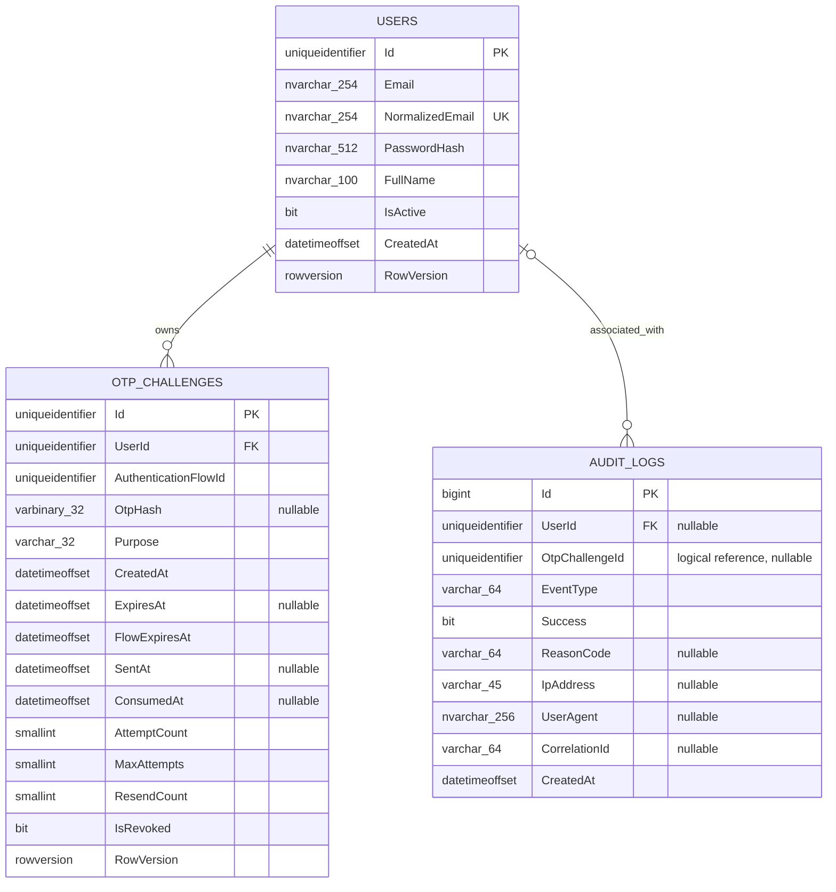

# PHASE 14 - Thiết kế database thực tế

## 1. Tổng quan

Hệ thống dùng **SQL Server** và **Entity Framework Core 10**. Model hiện tại có ba bảng:

- `Users`
- `OtpChallenges`
- `AuditLogs`

Schema được quản lý bằng hai migration đang có trong repository:

1. `20260822191004_InitialCreate`
2. `20260830163003_SupportPendingOtpChallenge`

Timestamps dùng `datetimeoffset(7)`. `User.Id`, `OtpChallenge.Id` và `AuthenticationFlowId` được application tạo bằng `Guid.NewGuid()`.

## 2. ERD



`AuditLogs.OtpChallengeId` chỉ là tham chiếu logic; model/migration không tạo foreign key tới `OtpChallenges`. Quan hệ vật lý chỉ gồm User–OtpChallenge và User–AuditLog.

## 3. Bảng `Users`

| Cột | SQL Server type | Null | Default/đặc điểm |
|---|---|---:|---|
| `Id` | `uniqueidentifier` | Không | Primary key, application tạo |
| `Email` | `nvarchar(254)` | Không | Email hiển thị đã trim |
| `NormalizedEmail` | `nvarchar(254)` | Không | Trim + `ToUpperInvariant()` ở service |
| `PasswordHash` | `nvarchar(512)` | Không | Format hash của `PasswordHasher<User>` |
| `FullName` | `nvarchar(100)` | Không | Đã trim ở DTO |
| `IsActive` | `bit` | Không | Default `1` |
| `CreatedAt` | `datetimeoffset(7)` | Không | UTC do application đặt |
| `RowVersion` | `rowversion` | Không | EF concurrency token |

### Key và index

- Primary key `PK_Users` trên `Id`.
- Unique index `UX_Users_NormalizedEmail` trên `NormalizedEmail`.

Source hiện tại **không có User CHECK constraint** cho độ dài/format email hoặc `FullName`. Các giới hạn này được thực thi bằng DTO validation; unique index là hàng rào database cho email trùng sau chuẩn hóa.

## 4. Bảng `OtpChallenges`

| Cột | SQL Server type | Null | Default/ý nghĩa |
|---|---|---:|---|
| `Id` | `uniqueidentifier` | Không | Primary key và opaque `challengeId` |
| `UserId` | `uniqueidentifier` | Không | FK tới `Users.Id` |
| `AuthenticationFlowId` | `uniqueidentifier` | Không | Giữ nguyên qua first send/resend trong cùng flow |
| `OtpHash` | `varbinary(32)` | Có | HMAC-SHA-256; null khi pending |
| `Purpose` | `varchar(32)` | Không | Hiện chỉ cho phép `LOGIN` |
| `CreatedAt` | `datetimeoffset(7)` | Không | Thời điểm tạo row |
| `ExpiresAt` | `datetimeoffset(7)` | Có | Hạn OTP; null khi pending |
| `FlowExpiresAt` | `datetimeoffset(7)` | Không | Hạn tuyệt đối của password flow |
| `SentAt` | `datetimeoffset(7)` | Có | Chỉ set sau SMTP/finalize thành công |
| `ConsumedAt` | `datetimeoffset(7)` | Có | Set sau verify đúng đã persist |
| `AttemptCount` | `smallint` | Không | Số OTP đúng format nhưng không khớp |
| `MaxAttempts` | `smallint` | Không | Default `5` |
| `ResendCount` | `smallint` | Không | Bắt đầu `0`, tối đa `3` |
| `IsRevoked` | `bit` | Không | Vô hiệu challenge |
| `RowVersion` | `rowversion` | Không | EF concurrency token |

### Foreign key và index

- `FK_OtpChallenges_Users_UserId`: `UserId -> Users.Id`, delete behavior `NO ACTION`.
- `IX_OtpChallenges_UserId_Purpose_CreatedAt` trên `(UserId, Purpose, CreatedAt DESC)`.
- `IX_OtpChallenges_AuthenticationFlowId_CreatedAt` trên `(AuthenticationFlowId, CreatedAt)`.
- Filtered unique index `UX_OtpChallenges_UserId_Purpose_Open` trên `(UserId, Purpose)` với filter:

```sql
[IsRevoked] = 0 AND [ConsumedAt] IS NULL
```

Index này bảo đảm tối đa một row chưa revoke/chưa consume cho mỗi `(UserId, Purpose)`. SQL Server không thể dùng thời gian hiện tại trong filter, nên challenge đã expired nhưng chưa revoke vẫn được xem là open; login/resend phải revoke row đó trước khi insert row mới.

### CHECK constraints đã có thật

| Constraint | Điều kiện chính |
|---|---|
| `CK_OtpChallenges_Purpose` | `[Purpose] = 'LOGIN'` |
| `CK_OtpChallenges_ExpiresAt` | `ExpiresAt` null, hoặc `CreatedAt < ExpiresAt <= FlowExpiresAt` |
| `CK_OtpChallenges_Attempts` | `0 <= AttemptCount <= MaxAttempts` và `1 <= MaxAttempts <= 5` |
| `CK_OtpChallenges_ResendCount` | `0 <= ResendCount <= 3` |
| `CK_OtpChallenges_OtpState` | Pending có hash/expiry/sent đều null; prepared/sent có hash 32 byte và expiry; nếu có `SentAt` thì `CreatedAt <= SentAt < ExpiresAt` |
| `CK_OtpChallenges_ConsumedState` | Nếu có `ConsumedAt` thì phải có `SentAt` và `SentAt <= ConsumedAt < ExpiresAt` |

Các constraint chưa mã hóa toàn bộ lifecycle. Ví dụ, database chưa bắt buộc `FlowExpiresAt = CreatedAt + 10 phút`, chưa bắt buộc `AttemptCount = MaxAttempts` đi cùng revoke và chưa cấm mọi tổ hợp vừa consumed vừa revoked. Những invariant này hiện do service kiểm tra.

## 5. Trạng thái `OtpChallenge`

| Trạng thái | `OtpHash` | `ExpiresAt` | `SentAt` | Terminal fields | Hành vi |
|---|---:|---:|---:|---|---|
| Pending | null | null | null | chưa consume/revoke | Chỉ được first send |
| Prepared | có | có | null | chưa consume/revoke | Đang chờ SMTP/finalize; không verify/resend |
| Sent | có | có | có | chưa consume/revoke | Verify được nếu còn hạn/lượt; resend sau cooldown |
| Consumed | có | có | có | `ConsumedAt != null` | Không verify lại hoặc resend |
| Revoked/locked | có thể có/null | có thể có/null | có thể có/null | `IsRevoked = 1` | Không verify hoặc resend |

Các giá trị mặc định được validation startup khóa theo implementation:

- OTP: 6 chữ số.
- OTP TTL: 3 phút, cắt tại `FlowExpiresAt` nếu cần.
- Flow TTL: 10 phút.
- Max attempts: 5.
- Resend cooldown: 60 giây từ `SentAt`.
- Max resends: 3.

Resend tạo **row mới**, giữ flow ID/hạn flow, tăng `ResendCount` và revoke row cũ. OTP cũ vì vậy không còn usable.

## 6. Bảng `AuditLogs`

| Cột | SQL Server type | Null | Ý nghĩa |
|---|---|---:|---|
| `Id` | `bigint IDENTITY(1,1)` | Không | Primary key |
| `UserId` | `uniqueidentifier` | Có | FK tới User khi xác định được |
| `OtpChallengeId` | `uniqueidentifier` | Có | Tham chiếu logic, không có physical FK |
| `EventType` | `varchar(64)` | Không | Event từ allowlist |
| `Success` | `bit` | Không | Kết quả event |
| `ReasonCode` | `varchar(64)` | Có | Reason từ allowlist |
| `IpAddress` | `varchar(45)` | Có | IP do server quan sát |
| `UserAgent` | `nvarchar(256)` | Có | Bị cắt tối đa 256 ký tự |
| `CorrelationId` | `varchar(64)` | Có | `TraceIdentifier`, bị cắt độ dài |
| `CreatedAt` | `datetimeoffset(7)` | Không | UTC từ `TimeProvider` |

### Key, relationship và index

- Primary key `PK_AuditLogs` trên `Id`.
- Nullable FK `FK_AuditLogs_Users_UserId`, delete behavior `NO ACTION`.
- `IX_AuditLogs_CreatedAt` trên `CreatedAt DESC`.
- `IX_AuditLogs_UserId_CreatedAt` trên `(UserId, CreatedAt DESC)`.
- `IX_AuditLogs_EventType_CreatedAt` trên `(EventType, CreatedAt DESC)`.
- Không có index trên `OtpChallengeId` trong model hiện tại.

Audit log được application sử dụng theo hướng append-only, nhưng database chưa có cơ chế kỹ thuật cấm `UPDATE`/`DELETE`. Schema không có cột password, OTP plaintext, OTP hash, JWT, Authorization header, request body hoặc exception tự do.

## 7. Event và reason code

Event types đang tồn tại trong source:

```text
REGISTER_SUCCESS
LOGIN_PASSWORD_SUCCESS
LOGIN_PASSWORD_FAILED
OTP_SEND_REQUESTED
OTP_CREATED
OTP_SENT
OTP_DELIVERY_FAILED
OTP_VERIFY_FAILED
OTP_EXPIRED
OTP_REPLAY_REJECTED
OTP_MAX_ATTEMPTS_REACHED
OTP_VERIFY_SUCCESS
OTP_RESEND_SUCCESS
OTP_RESEND_FAILED
JWT_ISSUED
```

Reason codes đang tồn tại:

```text
INVALID_CREDENTIALS
CHALLENGE_NOT_FOUND
USER_INACTIVE
WRONG_PURPOSE
CHALLENGE_REVOKED
CHALLENGE_LOCKED
OTP_EXPIRED
FLOW_EXPIRED
OTP_MISMATCH
OTP_NOT_SENT
DELIVERY_FAILED
RESEND_COOLDOWN
RESEND_LIMIT_REACHED
RESEND_NOT_AVAILABLE
```

`RESEND_LIMIT_REACHED` hiện được khai báo nhưng luồng resend đang dùng `RESEND_NOT_AVAILABLE` cho trường hợp không còn lượt.

## 8. Transaction và concurrency theo source

- **Register:** User và `REGISTER_SUCCESS` được lưu trong cùng `SaveChangesAsync`; unique index xử lý race email trùng.
- **Login đúng:** relational provider mở transaction bằng `BeginTransactionAsync`, revoke open challenges và persist trước, sau đó insert pending challenge cùng audit rồi commit.
- **First send:** persist prepared state/audit trước SMTP; sau SMTP success reload row, set `SentAt` và persist `OTP_SENT`. Không giữ transaction qua network.
- **Verify sai/đúng:** mutation challenge và audit tương ứng nằm trong cùng `SaveChangesAsync`. `RowVersion` phát hiện conflict; loop verify reload tối đa 6 lần.
- **Resend:** transaction ngắn revoke row cũ rồi insert prepared row mới; SMTP chạy sau commit. Finalize hoặc compensation là các lần persist riêng.

Code không chỉ định isolation level `Serializable`; transaction dùng isolation mặc định của SQL Server provider. Verify không dùng câu SQL conditional tự viết; các điều kiện được service kiểm tra lại và update được bảo vệ bằng `RowVersion` trong lệnh EF Core.

## 9. Migration history

### `InitialCreate`

- Tạo `Users`, `OtpChallenges`, `AuditLogs`.
- Tạo PK/FK/index, rowversion và các constraint OTP ban đầu.
- Ở schema ban đầu, `OtpHash` và `ExpiresAt` là non-null.

### `SupportPendingOtpChallenge`

- Chuyển `OtpHash` và `ExpiresAt` thành nullable.
- Thêm nullable `SentAt`.
- Backfill row cũ có OTP bằng `SentAt = CreatedAt`.
- Thêm `CK_OtpChallenges_OtpState` và `CK_OtpChallenges_ConsumedState`; cập nhật constraint expiry.
- `Down` revoke/fill pending rows trước khi khôi phục schema non-null cũ.

Migration files mô tả schema mong muốn của source. Việc một database môi trường cụ thể đã apply tới migration nào cần được xác nhận bằng EF CLI/database, không suy ra chỉ từ file tài liệu.

Hai migration hiện có được tạo ban đầu bằng EF Core 8 và được giữ nguyên như lịch sử migration. Runtime/tooling hiện tại dùng EF Core 10; việc nâng framework không làm thay đổi schema nên không tạo migration mới.

## 10. Dữ liệu nhạy cảm

| Dữ liệu | Lưu trong database? | Cách xử lý |
|---|---:|---|
| Password plaintext | Không | Chỉ `PasswordHash` của framework được lưu |
| OTP plaintext | Không | Chỉ tồn tại tạm trong memory để hash/gửi email |
| OTP HMAC | Có | `OtpHash varbinary(32)`, key nằm ngoài database/source |
| JWT | Không | Trả cho client sau verify; không persist |
| Application secrets | Không | User Secrets/environment/configuration provider |
| IP/User-Agent | Có thể | Chỉ trong audit, có giới hạn độ dài |

## 11. Giới hạn và vận hành

- Chưa có cleanup/retention job cho challenge và audit log.
- Chưa có database constraint cho toàn bộ lifecycle invariant.
- `AuditLogs.OtpChallengeId` không có FK/index; đây là chủ đích để giữ audit độc lập, nhưng truy vấn theo challenge chưa được tối ưu.
- Không hard-delete User trong luồng ứng dụng hiện tại; trạng thái hoạt động dùng `IsActive`.
- Backup encryption, least-privilege database account, retention và key rotation phải được cấu hình ở môi trường triển khai.
